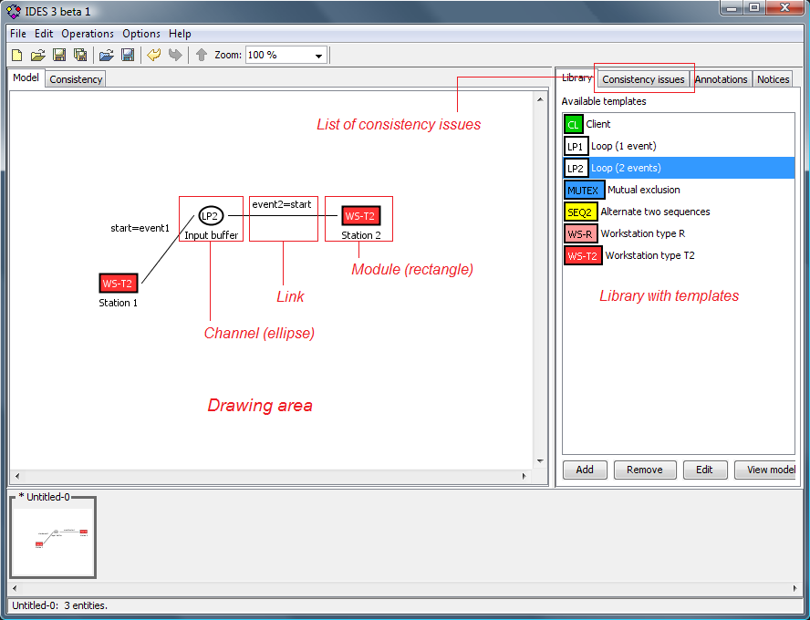

# Template Design plugin for IDES

## About

This is a plugin for [IDES](https://github.com/krudie/IDES) which provides
support for the design of DES control solutions using conceptual diagrams and templates.
The software was developed as a part of Lenko Grigorov's PhD thesis.

The template design (TD) methodology is a higher-level approach to the
classical DES problem solving, as described in \[L. Grigorov, B. Butler, J. E. R. Cury
and K. Rudie: 2011, 'Conceptual design of discrete-event systems
using templates'. Journal of Discrete-Event Dynamic Systems, 21(2), pp. 257-303\].

## License

This software is released under the [BSD license agreement](LICENSE.txt).

## Installation

IDES may already be distributed with the Template Design plugin included in the package.
Refer to the instructions on the [IDES project page](https://github.com/krudie/IDES)
how to install and launch IDES. Once IDES is started, you can verify that the plugin
is available by selecting "_View plugins_" from the "_Help_" menu.

If you do not see the Template Design plugin listed in IDES, you need to add the
plugin to IDES manually.

* Download the plugin release package. Make sure that you select a release version
which is compatible with the version of IDES which you are using.
* Copy the content of the "plugins" folder from the package into the "plugins" folder
where you installed IDES. The "templates.plugin.TemplatesPlugin.jar" file needs to be
located directly in the IDES "plugins" folder.
* Restart IDES to load the Template Design plugin.

## Compatibility

* Version 3.1.0 is compatible with IDES v3.1.
* Version 3.0.1 is compatible with IDES v3.0 beta 1 and IDES v3.1.

## Tutorial

A tutorial which describes how to use Template Design plugin can be found
[here](docs/help/Template%20Design%20Plugin%20Tutorial/index.md).

## Changelog

You can view the changelog [here](CHANGELOG.txt).
