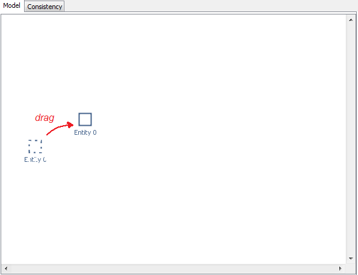
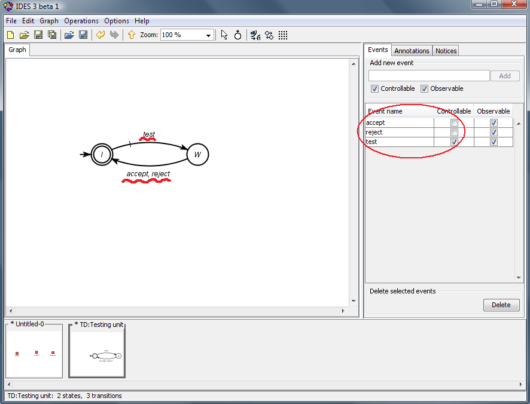
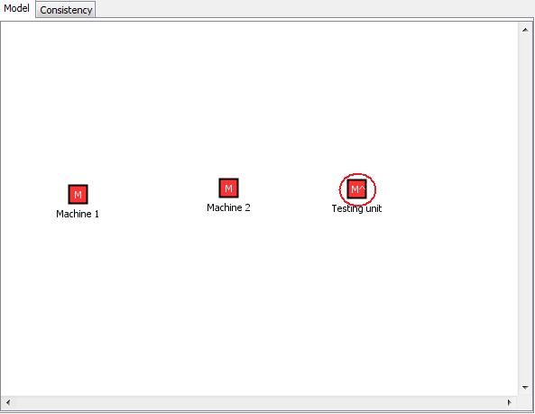
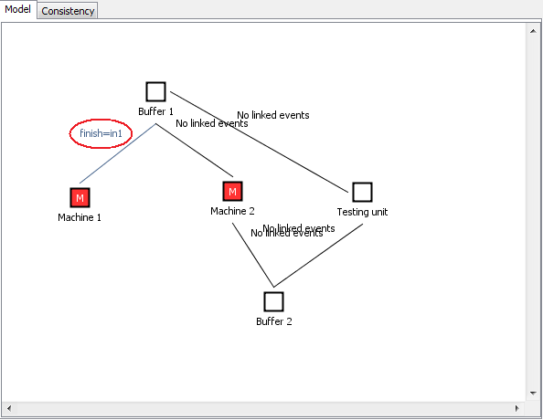
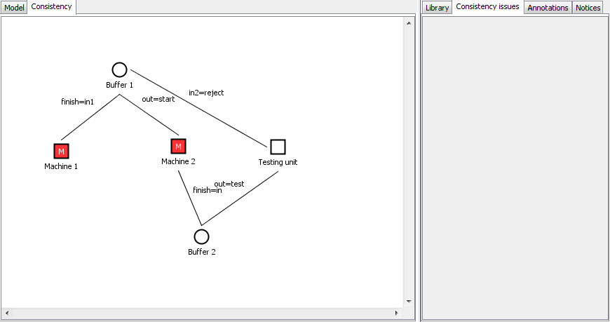

Modelling with the Template Design plugin for IDES
==================================================

Guided tutorial
---------------

In this tutorial, you will learn how use _template designs_ to model
and solve Discrete-Event System (DES) problems within the Ramadge&Wonham
framework \[Ramadge, P. J. and W. M. Wonham: 1987, 'Supervisory control
of a class of discrete event processes'. SIAM Journal on Control and
Optimization 25(1), 206-230\].

The template design (TD) methodology is a higher-level approach to the
classical DES problem solving \[L. Grigorov, B. Butler, J. E. R. Cury
and K. Rudie: 2011, 'Conceptual design of discrete-event systems
using templates'. Journal of Discrete-Event Dynamic Systems, 21(2), pp. 257-303\].
The low-level models are finite-state automata, as in the classical approach.
As well, the same computational algorithms are used.
However, TD supports conceptual modelling and automates most of the mundane tasks
involved in obtaining a supervisory solutions. The main differences are mentioned next.

* Conceptual models
* Templates
* Automatic event-name consistency
* No need to "self-loop" irrelevant events in specifications

Before starting the tutorial, make sure that you have installed Java 8 (or greater) and
IDES with the Template Design plugin. You can obtain Java from
[(here)](https://adoptopenjdk.net/), IDES from [(here)](https://github.com/krudie/IDES) 
and the TemplateDesign plugin from [(here)](https://github.com/lenkog/IDES-TD).
In case you would like to use LaTeX labels inside IDES, you also need to set up
LaTeX on your computer. To do so, refer to these
[(instructions)](https://github.com/krudie/IDES/blob/master/docs/help/LaTeX%20Rendering/index.md).
Please note that LaTeX will not be necessary for this tutorial.

How to start IDES with the Template Design plugin
----------------------------------------------------

IDES may already be distributed with the Template Design plugin included in the package.
Refer to the instructions on the [IDES project page](https://github.com/krudie/IDES)
how to install and launch IDES. Once IDES is started, you can verify that the plugin
is available by selecting "_View plugins_" from the "_Help_" menu.

If you do not see the Template Design plugin listed in IDES, you need to add the
plugin to IDES manually.

* Download the plugin release package from the
[Template Design plugin project page](https://github.com/lenkog/IDES-TD).
Make sure that you select a release version which is compatible with the
version of IDES which you are using.
* Copy the content of the "plugins" folder from the package into the "plugins" folder
where you installed IDES. The "templates.plugin.TemplatesPlugin.jar" file needs to be
located directly in the IDES "plugins" folder.
* Restart IDES to load the Template Design plugin.

Introduction
------------

### Interface

### Background

Template design contain entities (high-level representation of components).
There are two types of entities.

* _Modules_ are entities representing parts of the plant. Such entities are "active";
they generate the events in the system.
* _Channels_ are entities representing specifications for a set of modules.
Such entities are "passive"; they specify how parts of the plant should interact.

Each entity contains a low-level model of the given component (a finite-state automaton).
The low-level models specify the dynamics of each component, similar to
the use of finite-state automata in the classical approach.

The events in each entity are unique, independent of events in other entities - even
if having the same name. Modules and channels are synchronized by creating _links_
between them. Links establish which of the events of two given entities are considered
identical. Unlike the classical approach, it is not necessary to name synchronization
events with the same name. It is sufficient to link the events. Thus, a low-level model
can be reused in different scenarios without renaming events.

Links are relations between two entities only, where one entity is a module
and the other is a channel. Linking two modules is not allowed, as it can result
in inconsistencies in the design. If synchronizing two modules is necessary,
first the modules have to be composed using classical synchronization independently of the TD.
Then, the composition can be used as a single entity. Linking two channels is,
similarly, not allowed.

Template designs are geared toward modular supervision, where each channel
(specification) will be enforced by a separate supervisor. Such supervisors are "local",
relevant only to the modules linked to a channel. Local modular supervision is described
in \[de Queiroz , M. H. and J. E. R. Cury: 2000, 'Modular control of composed systems'.
Proceedings of the 2000 American Control Conference, 4051-4055.\]. In certain cases,
the modular solution may be blocking or suboptimal (i.e., the supervisors
are not "locally modular"). Then, a centralized supervisory solution can be computed
from the design, as well.

The "tdmodularsup" operation computes the modular supervisory solution and
checks if it is locally modular. The outputs of the operation depend on the
how many channels there are in the TD. For each channel, it produces the synchronous
composition of all linked modules, the synchronized channel model (with renamed
events and with self-loops of the irrelevant events) and the supervisor for the
synchronized channel with respect to the composed modules.

The "tdcentralsup" operation computes the centralized supervisory solution for the TD.
It composes all modules, synchronizes all channels and composes them,
and finally computes the supervisor for the composed channels with respect
to the composed modules.

The TD operations do not introduce new algorithms. They simply automate
the sequence of operations which need to be called in order to compute
the supervisors using the classical approach.

One of the benefits of using TD is that it is no longer necessary
to self-loop irrelevant events in specifications. Only the essence of a specification
needs to be modelled. It can then be linked to any module(s) and the irrelevant
events from the module(s) will be automatically added to the specification when
generating the control solution.

Finally, TD introduces _templates_ as building blocks of designs.
Commonly used low-level modules can be stored in a _template library_ for reuse.
Each template in the library can be instantiated numerous times in a design
or across designs to create different entities with the same underlying low-level model.
For example, if the same type of workstation is used in more than place in a factory,
one can create a template with the workstation model and then instantiate it
for each physical machine. Templates are useful when working with channels as well.
For example, the channel defining the alternation of two events is the same
regardless of the specific events. Thus, a template of this channel can be used
any time two events need to alternate.

Problem
-------

In this tutorial you will learn how to use the Template Design plugin for
IDES by solving a DES problem based on the "Transfer line" problem
\[Al-Jaar and Desrochers, 1988\] often used in literature as an example.
The description of the problem follows.

There is a factory that needs to be controlled. A diagram of the factory
is displayed above. There are two machines, M1 and M2, which process parts.
M1 takes a part from an input bin and delivers it to a 3-slot buffer, B1.
M2 picks up a part from B1 and when it is done processing, delivers it to
a 1-slot buffer, B2. At the end of the processing line there is a testing unit,
TU, which takes a part from B2 and tests if it meets the quality standards.
If the test is positive, the part is delivered to an output bin. Otherwise,
the part is delivered to B1 for reprocessing by M2. There is a microcontroller
in each of M1, M2 and TU which can control when a part is picked up
for processing by the machine/testing unit. However, once the part is taken,
the rest of the process is automatic and there is no control over when and
if the part is delivered to its destination (buffer or output).

Produce a supervisory control solution which guarantees that the buffers
do not overflow or underflow.

Modelling
---------

Modelling with TD starts by creating a conceptual design (high-level view)
of the system. Select "_New model_" from the "_File_" menu or click on the
toolbar icon. From the list of models, select the "_Template Deign_" model
type and click "_OK_".

If the "_Template Design_" model type is not available, the Template Design plugin
has not been installed correctly.

The next steps involve creating the entities in the design, creating
the low-level models, and linking the entities.

### Entities and low-level models

To create the entity for Machine 1, double-click on empty space,
or right-click on empty space and select "_Create entity_" from the pop-up menu.

To reposition the entity, press the mouse button down when the cursor is over
the entity icon, drag the entity to the desired location, and release the mouse button.

To rename the entity, double-click on the entity label or right-click the entity
and select "_Label_" from the pop-up menu. In the dialog, enter the desired name
(e.g., "Machine 1") and press the "Enter" key on the keyboard or just click outside
the dialog to close it. To cancel your changes, press the "Escape" key on the keyboard.

Each entity contains a low-level model. Newly created entities have empty models.
To access the model of Machine 1, double-click the entity icon, or select "_Show model_"
from the entity pop-up menu (right-click the entity).

An empty finite-state model appears. Observe that the name of the model
starts with "TD:". This model is a child of the parent, template design model.

Now you need to model the behavior of Machine 1. The desired model is shown next.

When you are done modelling, you can close the model by clicking on the "x" icon
in the top-right corner of the thumbnail (the icon appears when the mouse cursor
moves over the thumbnail).

As the low-level model for Machine 2 is exactly the same as that of Machine 1,
you can take advantage of the template library. First, you will create
a template of the Machine 1 model.

Click the "_Add_" button in the "_Library_" tab.

A dialog appears to ask for information about the template.

* The "ID" of the template is a short string of characters
which will appear in the icons of the template instances.
* The color will determine the background color of the template icon.
* The model specifies which model will serve as a template.
* The description is a verbal description of the template.

Fill out the information as shown next:

Click "_OK_" and observe the template being added to the template library.

To verify that the template was added correctly, you can double-click
the template or select it and click the "_View model_" button in
the "_Library_" tab.

This will provide access to the template model. It is identical
(a copy) of the model for Machine 1. Close the model and return to the TD model.

Now, you can instantiate the template to create the model for Machine 2.
Select the template, drag it over to an empty space and release
the mouse button. Observe how a new entity is created, with the icon
of the "Machine" template.

Label the entity appropriately. Viewing the low-level model of the Machine 2
entity will confirm that it is now a copy of the template.

To change the icon of the Machine 1 entity as well, you can drag
the template over the entity and release the mouse button.
This action will replace the model of the entity with a copy of the template,
and the icon will reflect that change.

Next, create the Testing unit entity and label it appropriately.

The model of the Testing unit, shown next, is very similar to the models
of the machines (it only has one extra event).

It will be faster to copy the model of one of the machines and just modify it.
Right-click on the Testing unit entity and select "_Replace model_" from
the pop-up menu.

In the dialog, you can select to replace the current (empty) model with
a new empty model, with a copy of one of the models loaded in IDES,
or with a copy of a template. Select the "TD:Machine1" model from
the drop-down list of loaded models.

Observe that the icon of the Testing unit changed to indicate that
it is a copy of the Machine 1 model.

Now open the Testing unit model to modify it (double-click the icon of
the entity). Rename the events and add one more event as needed.

Close the model. Observe that the icon of the Testing unit changed;
now it has a little marker ("^") to signify that the model has been
modified and is no longer an exact copy of the Machine template.

To reset the icon to its default form, right-click the Testing unit
entity and select "_Reset icon_" from the pop-up menu.

  

Proceed to create the entities for Buffers 1 and 2.
The models are displayed next.

Note that both Machine 1 and the Testing unit can deposit parts
into Buffer 1. Thus, there are two deposit events in the model.
The event names need not correspond to the event names in the machines
and the Testing unit. The mapping will be done by linking the entities.
Furthermore, unlike the classical approach, it is not necessary
to self-loop irrelevant events at each state of the models
of specifications. This will be done automatically by the software.

The controllability of events is determined by their controllability
settings in the modules. Thus, whether events are controllable
or uncontrollable in the channels is irrelevant for the final solution.

When you are ready with all entities and their low-level models,
it is time to link the entities.

  

### Linking

Links between models establish synchronization mapping between events.

Buffer 1 controls the operation of Machines 1 and 2 and the Testing unit.
To link Machine 1 with Buffer 1, follow these steps.

1. Click on one of the handles (little circles) which appear on
the sides of the Machine 1 entity when the mouse passes over it.
2. Move the mouse toward Buffer 1 and observe how a line follows
the mouse cursor.
3. Click on Buffer 1 to create the link between Machine 1 and Buffer 1.

As there are no linked events yet, the link will have
a "_No linked events_" label.

Links and link labels are placed automatically. It is not possible
to relocate them. If a better layout is desired, you need
to rearrange the connected entities.

Links can be created also by dragging. To link Machine 2 with Buffer 1,
follow these steps.

1. Press the mouse button down when the cursor is over one of
the handles (little circles) of Machine 2.
2. Drag the cursor to Buffer 1.
3. Release the mouse button when the cursor is over Buffer 1.

An alternative approach to creating links is to use the entity
pop-up menu. To link the Testing unit with Buffer 1, follow these steps.

1. Right-click on the Testing unit icon and select "Link" from
the pop-up menu.
2. Click on Buffer 1.

Proceed by linking Machine 2 and the Testing unit with Buffer 2.

The next step is to specify the events linked by all the links.

To specify the events for Machine 1 and Buffer 1, double-click
the corresponding link, or right-click the link and select
"_Set linked events_" from the pop-up menu.

A dialog box opens where it is possible to specify which events
from one entity correspond to which events from another entity.
In this case, the event "finish" in Machine 1 corresponds to
the event "in1" in Buffer 1.

Events are linked in a way similar to the linking of entities.
First, click on an event from one entity. Then move the mouse
toward an event from the other entity. A line will follow
the mouse cursor. Finally, click on the target event to link
the two events.

Events can be linked also by dragging. To remove an event link,
select the link and press the "Delete" key on the keyboard,
or select "_Delete_" from the pop-up menu (right-click the link).

To remove all event links, click the "_Clear linked events_" button.

When you are done linking the events, click "_OK_" or simply close
the dialog. Observe that the link between the entities will now display
that the events "finish" and "in1" are equivalent.

Moving the mouse cursor over the link will also display which events
are linked for each entity, at the corresponding ends of the link.

Now link all events as necessary.

* The event "start" in Machine 2 corresponds to
the event "out" in Buffer 1.
* The event "finish" in Machine 2 corresponds to
the event "in" in Buffer 2.
* The event "test" in the Testing unit corresponds to
the event "out" in Buffer 2.
* The event "reject" in the Testing unit corresponds to
the event "in2" in Buffer 1.

The template design is almost ready. Before you compute the solution,
check if there are consistency issues with the design.
The status bar in the bottom of the main window shows this information.

As in this case there are consistency issues, examine the information
in the "_Consistency issues_" tab in the right part of the window.
The tab lists a number of consistency issues as the design only contains
modules, and direct linking of modules is not allowed. By switching to
the "_Consistency_" tab in the left part of the window, all inconsistent
entities and links will be highlighted in orange (in this case,
all links are highlighted).

To correct these issues, it is necessary to specify which entities
are channels (i.e., specifications).

Right-click Buffer 1 and select "_Convert to channel_" from
the pop-up menu.

Repeat the same for Buffer 2. Observe that the icons of the two entities
became elliptic, rather than rectangular. The shape helps distinguish
which entities are modules and which are channels.

After converting Buffers 1 and 2 into channels, all consistency issues
have been resolved.

When you move the mouse cursor over a channel, an icon with
the letter "_S_" appears in the top-right corner. It offers a fast access
to the computation of the local supervisor for the given channel.
For example, it is possible to compute the local supervisor for Buffer 1.

Double-clicking this icon, or selecting "_Compute supervisor_" from
the Buffer 1 pop-up menu, calls the operation to produce the supervisor
for Buffer 1. The operation produces three outputs.

* The model whose name starts with "M\_" is the "plant", i.e.,
the composition of all modules connected to the channel.
* The model whose name starts with "C\_" is the "specification", i.e.,
the model of the channel where irrelevant events are self-looped.
* The model whose name starts with "S\_" is the supervisor computed
for the plant "M\_\*" and the specification "C\_\*".

All output models are annotated (see the "_Annotations_" tab on
the right side of the window).

If the automatically generated labels of the states in an output model
are too large, they can be simplified by clicking on the "_Simplify state labels_"
button in the toolbar. The state labels will be replaced with unique integers.

You can close all generated models and move on to the computation of
the overall supervisory solution.

Computing the supervisor
------------------------

It is possible to compute either a modular or centralized supervisory
solution. In this tutorial, a centralized solution will be computed.

Select "_DES operations_" from the "_Operations_" menu. In the dialog,
select the "tdcentralsup" operation and choose the template design as
the input. You can name the outputs if desired.

Click "_Compute_" and then close the dialog.

Three models were computed.

* The first one is the composition of all modules in the design.
* The second one is the composition of all channels, after they
have been synchronized with the corresponding modules.
* The third one is the supervisor for the composed channels with
respect to the composed modules.

All output models are annotated (see the "_Annotations_" tab on
the right side of the window).

The correct supervisor has 28 states and 65 transitions. The number of
states and transitions in a model are shown in the status bar in
the bottom of the main window.

In order to compute the modular supervisory solution, use
the "tdmodularsup" operation instead.

**Congratulations! You completed this tutorial.**
**You were introduced to the main features of Template Design with the IDES plugin.**